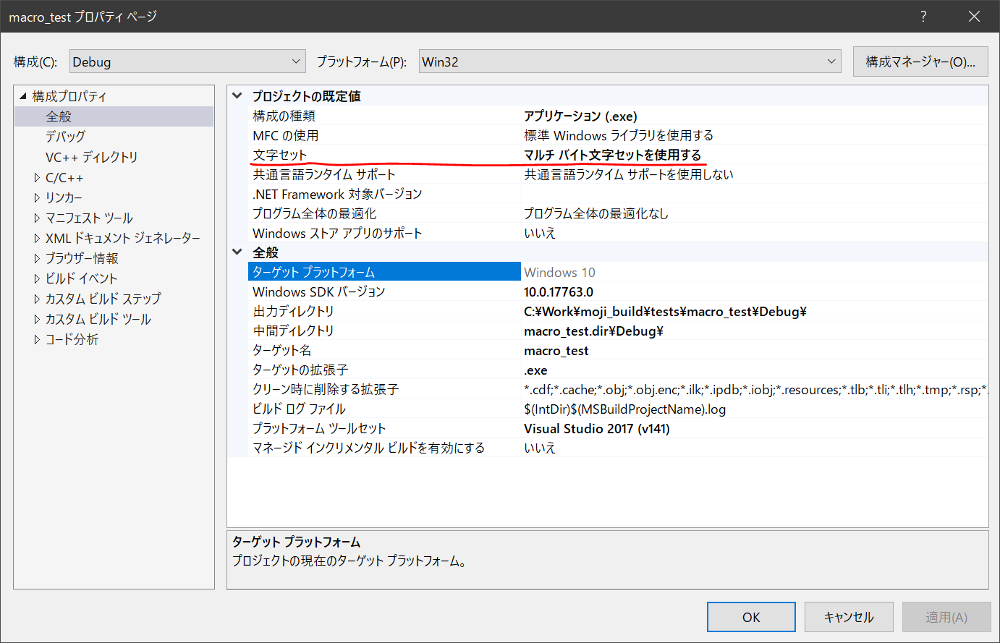

# moji
moji is library for using japanse language, a counting, displaying.

## tutorial
you should define `MOJI_MULTIBYTE` or `MOJI_WIDECHAR` symbol.
this symbol is need for determine primary character type.

* case if define MOJI_MULTIBYTE...
  * `MOJI_T` macro will defined as standard C string literal.
  * `moji_t` will defined as `char` type.
  * various represented by `moji_Xxxprintf` function will defined as Xxxprintf.

* case if define MOJI_WIDECHAR...
  * `MOJI_T` macro will defined as wide string literal.
  * `moji_t` will defined as `wchar_t` type.
  * various represented by `moji_Xxxprintf` function will defined as Xxxwprintf.

therefore, method of include for moji library is welcher below.
````
#define MOJI_MULTIBYTE
#include <moji/moji.h>
````

or

````
#define MOJI_WIDECHAR
#include <moji/moji.h>
````

## in Windows
need more step may be for display japanese in Windows OS .
* character type change to `multibyte character set`

* your will encoding change to UTF8(have a BOM) for file of source code
  * in example, usuable [kanjitranslator](https://www.kashim.com/kanjitranslator/)